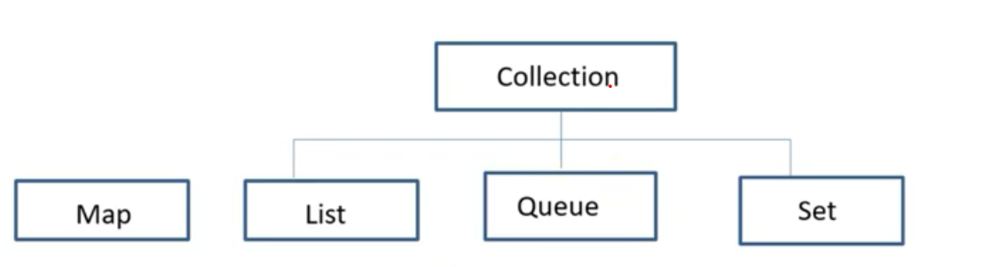

# Java Collections

**Collection** is the root of the Java. Collection framework and most of the collections in Java are inherited from this interface except Map Interface 

The framework includes:

* interfaces that represent different types of collections; 
* primary implementations of the interfaces; 
* legacy implementations from earlier releases \(known as "old collections"\);
* special-purpose implementations \(like immutable collections\); 
* algorithms represented by static methods that perform useful operations on collections. 

## List :

* Contains ordered elements
* May include duplicates
* Supports the index-based search, random access but elements can be easily inserted irrespective of the position.

## Queue

* follows a FIFO approach
* Elements adds at rear end and removes from the front end.

## Set

* Doesn’t define an order for the elements hence index-based search is not supported
* Doesn’t contain duplicates

## Map

* Represents a key, value pair
* Map interface does not implement the Collection.
* contain a unique key
* can have duplicate values

## BlockingQueue

The Java BlockingQueue interface, java.util.concurrent.BlockingQueue, represents a queue which is thread safe to put elements into, and take elements out of from. In other words, multiple threads can be inserting and taking elements concurrently from a Java BlockingQueue, without any concurrency issues arising.

