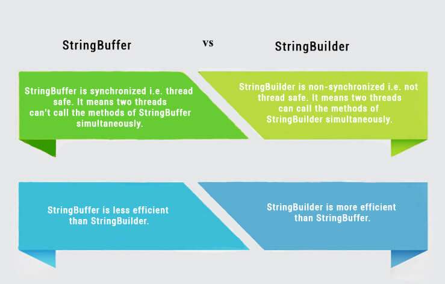

# More Topics

- [Features in Java](#features-in-java)
- [Comparable Vs Comparator](#comparable-vs-comparator-in-java)
- [Generics](#generics-in-java)
- [Instance variable Vs class variable](#difference-between-instance-variable-and-class-variable)
- [Array vs ArrayList in Java](#array-vs-arrayList-in-java)
- [Array list vs Vector in Java](#-array-list-VS-Vector-in-Java)
- [Heap and Stack Memory in Java](#heap-and-Stack-Memory-in-Java)
- [StringBuffer Vs StringBuilder](#stringBuffer-vs-stringBuilder)

## Features in Java

1. OOP concepts
    - [Interface](#interface)
    - [Inheritance](#inheritance)
    - [Encapsulation](#encapsulation)
    - [Polymorphism](#polymorphism)
    - [Abstraction](#abstraction)
1. Platform independent: A single program works on different platforms without any modification.
1. High Performance: JIT (Just In Time compiler) enables high performance in Java. JIT converts the bytecode into machine language and then JVM starts the execution.
1. Multi-threaded: A flow of execution is known as a Thread. JVM creates a thread which is called the main thread. The user can create multiple threads by extending the thread class or by implementing the Runnable interface.

### Inheritance

Inheritance means one class can extend to another class. So that the codes can be reused from one class to another class.

### Interface

An interface is a template which has only method declarations and not the method implementation.
Multiple inheritances cannot be achieved in java. To overcome this problem Interface concept is introduced.

### Encapsulation

- Protects the code from others.
- Code maintainability.

#### Example:

We are declaring ```a``` as an integer variable and it should not be negative.

```java
public class Addition() {
    int a = 5;
}
```

If someone changes the exact variable as “a = -5” then it is bad.

In order to overcome the problem we need to follow the below steps:

- We can make the variable as private or protected one.
- Use public accessor methods such as setters and getters.

### Polymorphism

Polymorphism means many forms.

A single object can refer to the super-class or sub-class depending on the reference type which is called polymorphism.
Polymorphism is applicable for **overriding** and **not for overloading**.

### Abstraction

- A abstract class contains the keyword ```abstract```
- An abstract class may have non- abstract method also.
- The concrete Subclass which extends the Abstract class should provide the implementation for abstract methods.

***Abstract method***: The method which has only the declaration and not the implementation is called the abstract method and it has the keyword called ```abstract``` Declarations are the ends with a semicolon.

#### Example

```java
public abstract class Manupulation{
    public abstract void add();//Abstract method declaration
    public void subtract(){}
}
```

## Comparable Vs Comparator in Java

[Link](https://www.geeksforgeeks.org/comparable-vs-comparator-in-java/)
 **or**
[video](https://www.youtube.com/watch?v=oAp4GYprVHM)

## Generics in Java

Link [geeksforgeeks](https://www.geeksforgeeks.org/generics-in-java/)

Generics enable types (classes and interfaces) to be parameters when defining classes, interfaces and methods.
Much like the more familiar formal parameters used in method declarations, type parameters provide a way for you to re-use the same code with different inputs.
The difference is that the inputs to formal parameters are values, while the inputs to type parameters are types.

Code that uses generics has many benefits over non-generic code:

- Stronger type checks at compile time.
A Java compiler applies strong type checking to generic code and issues errors if the code violates type safety.
Fixing compile-time errors is easier than fixing runtime errors, which can be difficult to find.
- Elimination of casts.
- Enabling programmers to implement generic algorithms.
By using generics, programmers can implement generic algorithms that work on collections of different types, can be customized, and are type safe and easier to read.

In this [video](https://www.youtube.com/watch?v=XMvznsY02Mk) we will see :

- What is Generics
- What is Type-safe Language
- How to achieve type safety
- An example or program of Generics implementation in Java

## Difference between instance variable and a class variable.

An instance variable is a variable which has one copy per object/instance. That means every object will have one copy of it.
A class variable is a variable which has one copy per class. The class variables will not have a copy in the object.
Example :

```java
class Employee {
    int empNo;
    String empName, department;
    double salary;
    static int officePhone;
}
```

An object referred by empObj1 is created by using the following:
```Employee empObj1 = new Employee();```

The objects referred by instance variables empObj1 and empObj2 have separate copies empNo, empName, department, and salary. However, the officePhone belongs to the class(Class Variable) and can be accessed as Employee.officePhone.

Static variable: Static variables are also known as Class variables.

## Array vs ArrayList in Java

- Array is a fixed size data structure while ArrayList is not. One need not to mention the size of Arraylist while creating its object. Even if we specify some initial capacity, we can add more elements.
- An array is basic functionality provided by Java. ArrayList is part of collection framework in Java. Therefore array members are accessed using [], while ArrayList has a set of methods to access elements and modify them.
- Array can contain both primitive data types as well as objects of a class depending on the definition of the array. However, ArrayList only supports object entries, not the primitive data types.

## Array list VS Vector in Java

|ArrayList|Vector|
|-|-|
|Array List is not synchronized.| Vector is synchronized.|
|Array List is fast as it’s non-synchronized.|Vector is slow as it is thread safe.|
|Array List does not define the increment size.|Vector defines the increment size.|
|Array List can only use Iterator for traversing an Array List.|Vector can use both Enumeration and Iterator for traversing.|

## Heap and Stack Memory in Java

The major difference between Heap and Stack memory are:

|Features|Stack|Heap|
|:-:|:-:|:-:|
|**Memory**|Stack memory is used only by one thread of execution.|Heap memory is used by all the parts of the application.|
|**Access**|Stack memory can’t be accessed by other threads.|Objects stored in the heap are globally accessible.|
|**Memory Management**|Follows **LIFO** manner to free memory.|Memory management is based on the generation associated with each object.|
|**Lifetime**|Exists until the end of execution of the thread.|Heap memory lives from the start till the end of application execution.|
|**Usage**|Stack memory only contains local primitive and reference variables to objects in heap space.|Whenever an object is created, it’s always stored in the Heap space.|

## StringBuffer Vs StringBuilder



|Factor|String|StringBuilder|StringBuffer|
|:-:|:-:|:-:|:-:|
|**Storage Area**|Constant String Pool|Heap Area|Heap Area|
|**Mutability**|Immutable|Mutable|Mutable|
|**Thread Safety**|Yes|No|Yes|
|**Performance**|Fast|More efficient|Less efficient|
