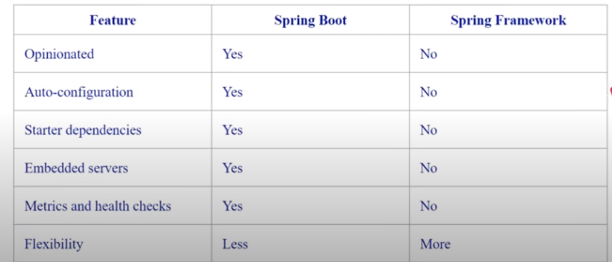

# Spring Boot&#x20;

<figure><figcaption></figcaption></figure>

<figure><figcaption>
<strong>Sprint Boot Started</strong>
</figcaption></figure>

<figure><figcaption></figcaption></figure>

<figure><figcaption></figcaption></figure>

<figure><figcaption></figcaption></figure>

<figure><figcaption>
Spring vs Spring-boot
</figcaption></figure>

<figure><figcaption>
Acuator Endpoint
</figcaption></figure>

<figure><figcaption>
Relax Binding
</figcaption></figure>

<figure><figcaption>
Deifferent States of Persistent Entity
</figcaption></figure>

<figure><figcaption></figcaption></figure>
