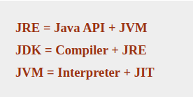

# QA

### Why Java is not 100% Object-oriented?

Because of Primitive data types namely:

```
  boolean, byte, char, int, float, double, long, short.
```

To make them 00 we have wrapper classes that actually _wrap_ the primitive data type into an object of that class.

### Why pointers are not used in Java?

1. They are unsafe.
2. Increases the complexity of the program and since Java is known for its simplicity of code, adding the concept of pointers will be contradicting.
3. Since JVM is responsible for implicit memory allocation, thus in order to avoid direct access to memory by the user, pointers are discouraged in Java

### What is JIT compiler in Java?


## JRE , JDK, and JVM

<figure><figcaption></figcaption></figure>

### Why String is immutable in java?

1.  String pool requires string to be immutable otherwise shared reference can be

    changed from anywhere.
2.  security because string is shared on different area like file system, networking

    connection, database connection , having immutable string allows you to be secure and safe because no one can change reference of string once it gets created.

### What is a marker interface?

A Marker interface can be defined as the interface having no data member and member functions. In simpler terms, an empty interface is called the Marker interface. `E.g. Serializable, Cloneable`

### Does `finally` always execute in Java?

Not in the following cases:

1. `System.exit()` function
2. `system crash`

### Can you override a private or static method in Java?

1. you can not override a private or static method in Java.
2. you cannot override a private method in subclass because it’s not accessible there, what you do is create another private method with the same name in the child class.
3. For static methods if you create a similar method with the same return type and the same method arguments in child class then it will hide the superclass method, this is known as method hiding.

### What Methods Does the Object Class Have?

* Protected Object **clone()** throws CloneNotSupportedException Creates and returns a copy of this object.
* public boolean **equals(Object obj)** Indicates whether some other object is “equal to” this one.
* protected void **finalize()** throws Throwable Called by the garbage collector on an object when garbage-collection determines that there are no more references to the object
* public final Class **getCIass()** : Returns the runtime class of an object.
* public int **hashCode()**: Returns a hash code value for the object.
* public String **toString()**: Returns a string representation of the object.
* public final void **notify()**
* public final void **notifyAll()**
* public final void **wait()**
* public final void **wait(long timeout)**
* public final void **wait(long timeout, int nanos)**

### How Can You Make a Class Immutable?

* Declare the **class as final** so it can’t be extended.
* Make all **fields private** so that direct access is not allowed.
* **Don’t provide setter** methods for variables
* Make **all mutable fields** final so that their values can be assigned only once.
* Initialize all the fields via a **constructor performing a deep copy.**
* Perform **cloning of objects** in the getter methods to return a copy rather than returning the actual object reference.
