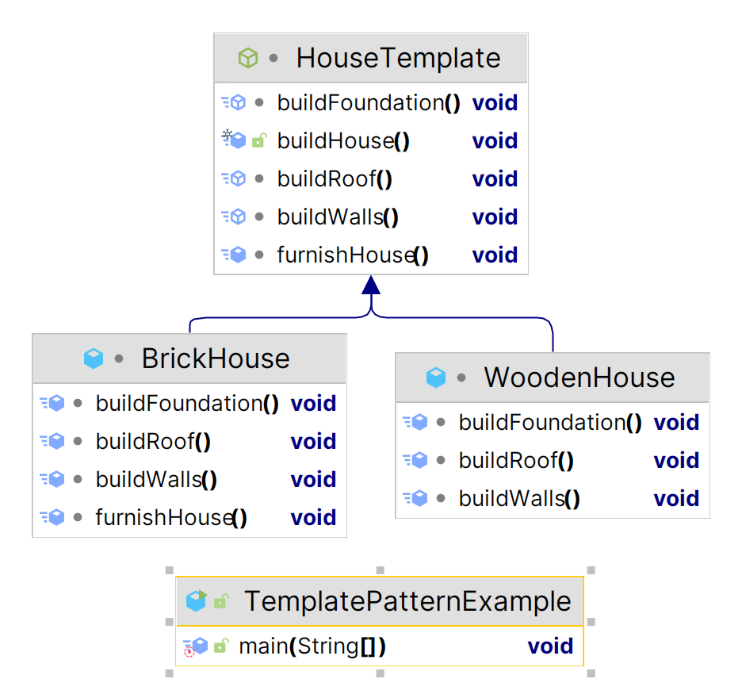

# Template Pattern

Certainly! The Template Method Pattern in Java is used to define the skeleton of an algorithm in a method, deferring some steps to subclasses. Here's an example using a template for building different types of houses:

[Template](https://github.com/tuhin47/AlgoExpert/blob/b9d5010da1512ff5e9ad489b911340a71f1b99c3/Java/src/patterns/examples/TemplatePatternExample.java)

<figure><figcaption></figcaption></figure>

In this example, `HouseTemplate` is an abstract class that defines the template method `buildHouse()` which lays out the steps required to build a house (foundation, walls, roof, and optional furnishing). Subclasses `WoodenHouse` and `BrickHouse` extend the `HouseTemplate` and implement the abstract methods specific to their construction material.

When `buildHouse()` is called on instances of `WoodenHouse` and `BrickHouse`, it follows the steps defined in the template method. The `furnishHouse()` method acts as a hook that can be optionally overridden by subclasses to provide specific behavior, as shown in the case of the `BrickHouse`.
