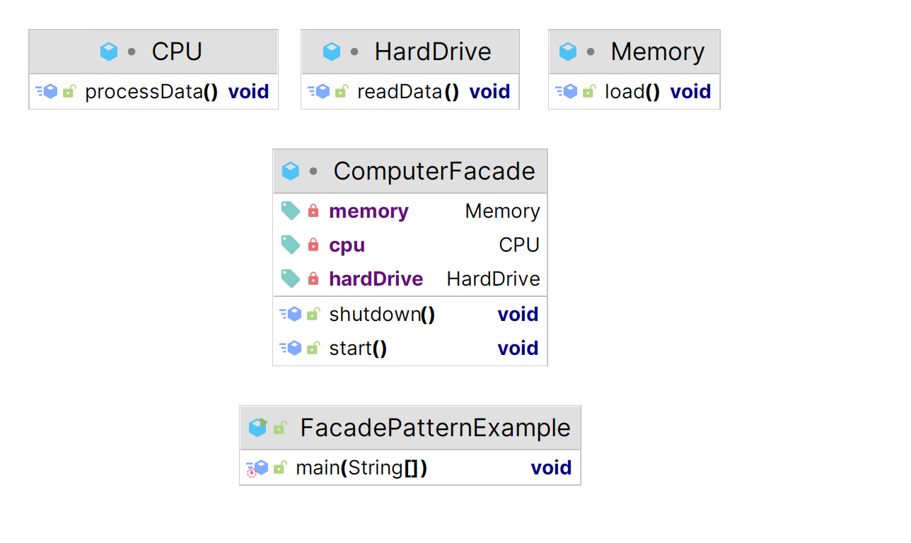

# Facade Pattern

The Facade Pattern in Java is a structural design pattern that provides a simplified interface to a complex subsystem. It encapsulates a group of interfaces in a higher-level interface, making the subsystem easier to use. Let's consider an example of a computer system with various components managed by a facade:

[Facade](https://github.com/tuhin47/AlgoExpert/blob/b9d5010da1512ff5e9ad489b911340a71f1b99c3/Java/src/patterns/examples/FacadePatternExample.java) \
\

<figure><figcaption></figcaption></figure>

In this example, the `CPU`, `Memory`, and `HardDrive` classes represent the complex subsystem of a computer system, each responsible for specific operations. The `ComputerFacade` class acts as a facade providing a simple interface to start the computer (`start`) and shut it down (`shutdown`).

When using the `ComputerFacade`, clients don't need to interact directly with individual components of the computer system. Instead, they use the facade methods to handle the complexity of starting and shutting down the computer. This pattern hides the complexities of the subsystem and offers a simplified interface for interacting with it.
