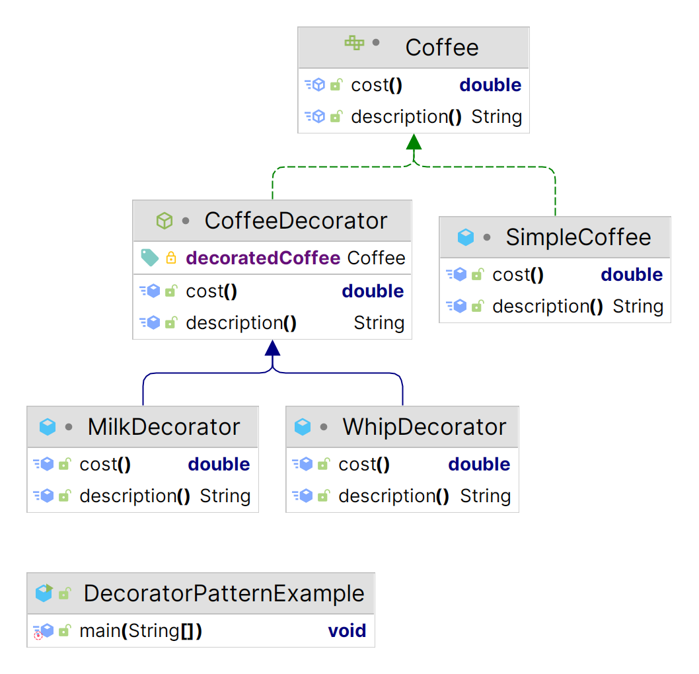

# Decorator  Pattern

The Decorator Pattern in Java allows behavior to be added to individual objects dynamically, without affecting the behavior of other objects from the same class. It's often used to extend the functionality of objects at runtime. Let's consider an example using a simple coffee shop scenario:

[Decorator](https://github.com/tuhin47/AlgoExpert/blob/b9d5010da1512ff5e9ad489b911340a71f1b99c3/Java/src/patterns/examples/DecoratorPatternExample.java)

<figure><figcaption></figcaption></figure>

In this example, `Coffee` is the interface representing the coffee behavior. `SimpleCoffee` is a concrete implementation of a basic coffee. `CoffeeDecorator` is an abstract class implementing the `Coffee` interface and acting as the base for all decorators. `MilkDecorator` and `WhipDecorator` are concrete decorators that add functionality (cost and description) to the coffee.

By chaining decorators, you can dynamically add new functionalities to a base object (`SimpleCoffee`) at runtime, allowing for flexible and reusable combinations of behaviors.
